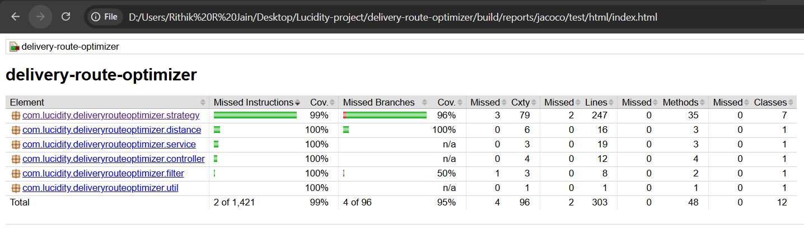
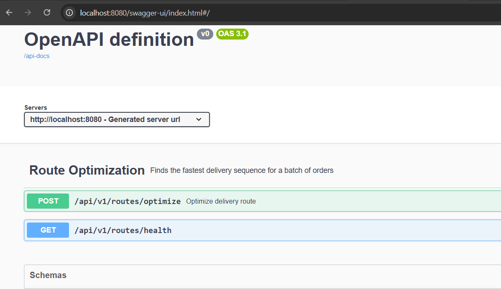
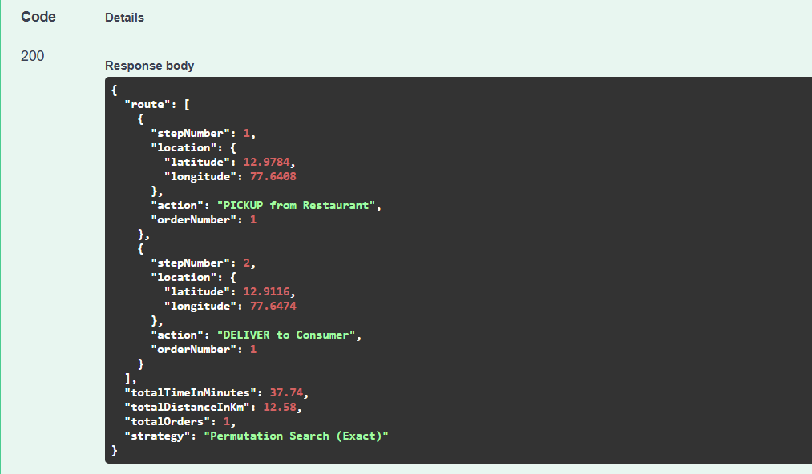
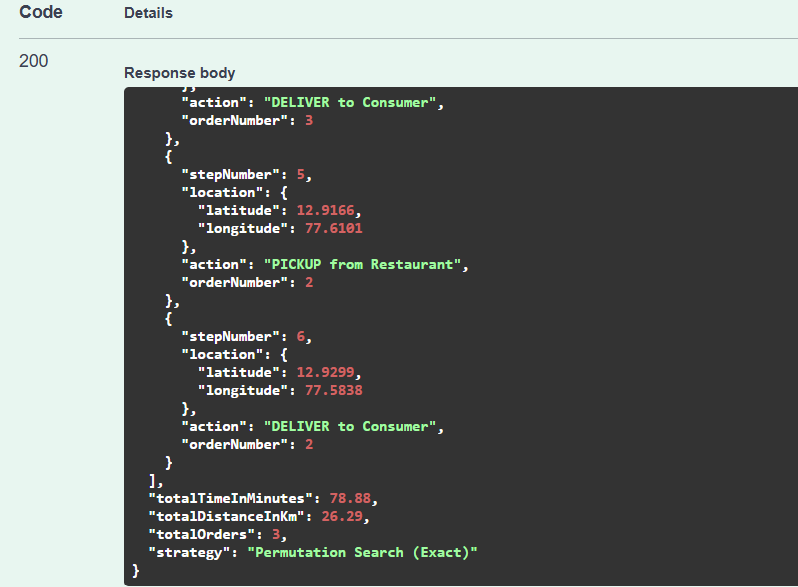
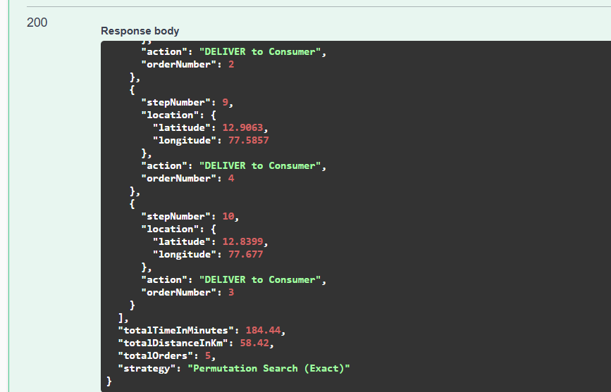
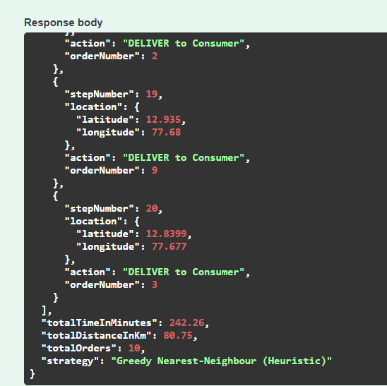

# Delivery Route Optimizer

A Spring Boot service that figures out the fastest delivery route for a batch of food orders. Given a delivery executive's location and N orders (each with a order number, restaurant, a consumer, and a meal prep time), it returns the optimal sequence of pickups and deliveries.

Built as a take-home assignment for Lucidity.

---

## What's the Problem?

Picture this - a delivery executive named Aman is standing in Koramangala. His phone buzzes. He's been assigned 2 (or more) orders, each from a different restaurant going to a different consumer. Every restaurant started cooking the moment the batch was assigned.

Now Aman needs to figure out: **What's the fastest way to pick up and deliver everything?**

This isn't just "visit the nearest place first." He might want to pick up from Restaurant 1, deliver to Consumer 1 (while Restaurant 2's food is still cooking), and *then* swing by Restaurant 2 when the food is actually ready - instead of standing around waiting. The algorithm needs to explore these interleaved sequences and find the one that minimizes total time.

---

## Tech Stack

| Tool | Version |
|------|---------|
| Java | 21 |
| Spring Boot | 3.4.4 |
| Gradle | 8.12 |
| JUnit 5 + Mockito | For testing |
| JaCoCo | 0.8.12 (Code coverage) |
| SpringDoc OpenAPI | 2.8.6 (Swagger UI) |

No database - this is a stateless computation service. Send a request, get a route.

---

## Project Structure

```
src/main/java/com/lucidity/deliveryrouteoptimizer/
│
├── DeliveryRouteOptimizerApplication.java    # Entry point
│
├── controller/
│   └── RouteController.java                  # REST endpoint
│
├── filter/
│   └── RequestTracingFilter.java             # Assigns unique request ID to every request via MDC
│
├── constants/
│   └── AppConstants.java                     # Application-wide constants
│
├── vo/                                       # Value objects (DTOs)
│   ├── LocationVo.java                       # Latitude + Longitude
│   ├── OrderVo.java                          # Restaurant, Consumer, Prep time, Order number
│   ├── DeliveryRequestVo.java                # Incoming request payload
│   ├── DeliveryResponseVo.java               # Optimized route response
│   └── RouteStepVo.java                      # Single step in the route
│
├── strategy/                                 # Route-finding algorithms
│   ├── RoutingStrategy.java                  # Interface (Strategy pattern)
│   ├── RouteProblemContext.java               # Encapsulates problem inputs for strategy execution
│   ├── PermutationRoutingStrategy.java       # Exact solver (small batches)
│   ├── GreedyRoutingStrategy.java            # Heuristic (large batches)
│   └── CompositeRoutingStrategy.java         # Auto-selects between the two
│
├── service/
│   └── RouteOptimizerService.java            # Business logic, delegates to strategy
│
├── distance/                                 # Distance calculation
│   ├── DistanceCalculator.java               # Interface
│   └── HaversineCalculator.java              # Haversine implementation
│
├── util/
│   └── DeliveryTimeHelper.java               # Shared helpers (rounding, etc.)
│
└── exception/
    ├── GlobalExceptionHandler.java           # Catches all errors cleanly
    ├── InvalidRequestException.java          # Custom business exception
    └── ErrorResponse.java                    # Structured error body
```

---

## Features

- **Adaptive algorithm selection** - exact solver algorithm for small batches, greedy heuristic algorithm for large ones. Switches automatically based on a configurable threshold.
- **Interleaved pickups and deliveries** - doesn't assume "pick up everything first, then deliver." Freely mixes pickups and deliveries for faster routes.
- **Meal prep time awareness** - if the exec arrives before food is ready, the waiting time is factored in. The algorithm routes the exec elsewhere while food cooks.
- **Order number tracking** - each order carries its own `orderNumber` from the request, preserved through the entire response for easy tracing.
- **Haversine distance** - uses the great-circle formula with a configurable average speed (default 20 km/hr). Pluggable via `DistanceCalculator` interface.
- **Request tracing** - every request gets a unique 8-character ID via MDC. All log lines for that request carry this ID. Returned in the `X-Request-Id` response header.
- **Input validation** - latitude/longitude ranges, positive prep times, non-empty order lists, valid order numbers. All validated with clear error messages.
- **Thread-safe by design** - all routing computations use method-local variables with no shared mutable state. Handles concurrent requests out of the box.
- **Code coverage** - JaCoCo enforces minimum 80% coverage. VOs and exception classes excluded from calculation.
- **Swagger UI** - interactive API docs at `/swagger-ui.html`.
- **Configurable via YAML** - algorithm threshold, average speed, thread pool - all externalized. No magic numbers buried in code.

---

## Setup

### Prerequisites

- **Java 21** - [OpenJDK](https://openjdk.org/)
- **Git**

### Clone and Build

```bash
git clone https://github.com/rithik-jain/delivery-route-optimizer.git
cd delivery-route-optimizer
./gradlew build
```

Gradle wrapper is included - you don't need Gradle installed separately.
> **Note:** The initial project scaffold was pushed directly to `main`. All subsequent development was done in a `feature/routeOptimizerImpl` branch with sequential, topic-based commits - from models → algorithms → tests → docs. The feature branch was then merged into `main` via a [Pull Request](https://github.com/rithik-jain/delivery-route-optimizer/pull/1). You can walk through the commit history and the PR to see how the project was built incrementally.
---

## Run Application

```bash
./gradlew bootRun
```

The service starts on `http://localhost:8080`.

### Verify it's running

```bash
curl http://localhost:8080/api/v1/routes/health
```

Response:
```
Delivery Route Optimizer is up and running!
```

---

## Run Tests

```bash
./gradlew test
```

Test reports are generated at `build/reports/tests/test/index.html`.

Tests cover:

- **Haversine calculations** - validated against known city-to-city distances (Bangalore to Mumbai, Koramangala to Indiranagar)
- **DeliveryTimeHelper** - rounding logic, edge cases
- **Exact solver** - correctness, precedence constraints, prep time handling, edge cases
- **Greedy solver** - precedence constraints, large batch performance (15 and 50 orders under 1 second)
- **Composite strategy** - delegation logic, threshold boundaries, just-above-threshold behaviour
- **Service layer** - delegation, exception propagation with timing
- **Controller (integration)** - full HTTP round-trips, input validation, malformed JSON, error responses, `X-Request-Id` header

### Code Coverage

```bash
./gradlew test jacocoTestReport
```

Coverage report: `build/reports/jacoco/test/html/index.html`

The build enforces a minimum **80% code coverage**. VOs and exception classes are excluded from the calculation since they're mostly boilerplate getters/setters.

To run coverage verification (fails build if below 80%):

```bash
./gradlew check
```



---

## Swagger UI

Once the application is running, open:

```
http://localhost:8080/swagger-ui.html
```

You can try out the API directly from the browser - paste in a JSON request, hit Execute, and see the response.



---

## API Endpoints

### Health Check

```
GET /api/v1/routes/health
```

Returns a simple status message. No request body needed.

### Optimize Route

```
POST /api/v1/routes/optimize
```

**Request Body:**

```json
{
  "deliveryExecutiveLocation": {
    "latitude": 12.9352,
    "longitude": 77.6245
  },
  "orders": [
    {
      "orderNumber": 100,
      "restaurantLocation": { "latitude": 12.9784, "longitude": 77.6408 },
      "consumerLocation": { "latitude": 12.9116, "longitude": 77.6474 },
      "mealPreparationTimeInMinutes": 15
    },
    {
      "orderNumber": 200,
      "restaurantLocation": { "latitude": 12.9166, "longitude": 77.6101 },
      "consumerLocation": { "latitude": 12.9299, "longitude": 77.5838 },
      "mealPreparationTimeInMinutes": 25
    }
  ]
}
```

**Response:**

```json
{
  "route": [
    { "stepNumber": 1, "action": "PICKUP from Restaurant", "orderNumber": 2, "location": { "latitude": 12.9166, "longitude": 77.6101 } },
    { "stepNumber": 2, "action": "PICKUP from Restaurant", "orderNumber": 1, "location": { "latitude": 12.9784, "longitude": 77.6408 } },
    { "stepNumber": 3, "action": "DELIVER to Consumer", "orderNumber": 1, "location": { "latitude": 12.9116, "longitude": 77.6474 } },
    { "stepNumber": 4, "action": "DELIVER to Consumer", "orderNumber": 2, "location": { "latitude": 12.9299, "longitude": 77.5838 } }
  ],
  "totalTimeInMinutes": 59.62,
  "totalDistanceInKm": 19.87,
  "totalOrders": 2,
  "strategy": "Permutation Search (Exact)"
}
```

**Response Headers:**

```
X-Request-Id: a3f2c1d9
```

**Error Response (validation failure):**

```json
{
  "timestamp": "2025-03-22T10:30:00",
  "status": 400,
  "error": "Validation Failed",
  "messages": [
    "orders: At least one order is required"
  ]
}
```

---

## How Each Strategy Works

### Exact Solver (PermutationRoutingStrategy)

Used for **small batches (≤ 7 orders by default)**.

For N orders, there are 2N stops (N pickups + N deliveries). The solver recursively explores every valid ordering of these stops, with the constraint that you must pick up the order i before delivering it.

**Optimisations that keep it practical:**

| Technique | What it does |
|-----------|-------------|
| Pre-computed travel matrix | All pairwise Haversine distances calculated once upfront into a 2D array. No repeated math inside recursion. |
| Greedy upper-bound seeding | A quick greedy pass before the search gives an initial "best time" to prune against. |
| Branch pruning | If a partial route already exceeds the current best, that entire branch is abandoned. |
| Lower-bound estimation | If remaining prep times alone would push total past the current best, the branch is cut. |

**Time Complexity:**

- **Worst case:** O((2N)!) - all permutations of 2N stops. In practice, much lower due to pruning.
- **With pruning:** Empirically closer to O(N! × 2^N) for typical inputs. For N=7, this runs in milliseconds.
- **Space:** O(N²) for the travel matrix + O(N) recursion depth.

**Interleaving:** At every recursive step, the solver considers ALL unvisited restaurants AND all deliverable consumers. So it naturally explores sequences like "pick up order 1, deliver order 1, then pick up order 2" - not just "pick up everything first."

### Greedy Heuristic (GreedyRoutingStrategy)

Used for **large batches (> 7 orders)**.

At each step, it looks at every legal next move (unvisited restaurant or deliverable consumer) and picks the one with the lowest "effective cost" - a weighted blend of travel time and idle waiting time.

This means it can do smart things like: "Restaurant A is 2 km away but the food won't be ready for 20 minutes. Restaurant B is 4 km away but the food is done. Go to B."

It gives a slight priority to deliveries over pickups (via a 0.95 multiplier) to avoid holding onto food unnecessarily.

**Time Complexity:**

- **Time:** O(N²) - at each of the 2N steps, we evaluate up to 2N candidates.
- **Space:** O(N) - just tracking which stops have been visited.

Runs in milliseconds even for 50+ orders.

**Trade-off:** It won't always find THE optimal route, but it finds a very good one very quickly.

---

## Request Tracing

Every incoming request is assigned a unique 8-character request ID by `RequestTracingFilter`. This ID is:

1. **Stored in SLF4J's MDC** - so every log line produced during that request automatically includes it, across all classes, without any manual passing.
2. **Returned in the `X-Request-Id` response header** - so the caller can correlate their request with server-side logs.

**Sample log output:**

```
08:15:32.445 [http-nio-8080-exec-1] [a3f2c1d9] INFO  RouteController - POST /optimize - 3 orders from location (12.935200, 77.624500)
08:15:32.446 [http-nio-8080-exec-1] [a3f2c1d9] INFO  RouteOptimizerService - Received optimization request with 3 orders
08:15:32.447 [http-nio-8080-exec-1] [a3f2c1d9] INFO  CompositeRoutingStrategy - Batch size 3 ≤ threshold 7. Using exact solver.
08:15:32.448 [http-nio-8080-exec-1] [a3f2c1d9] INFO  PermutationRoutingStrategy - Running exact permutation search for 3 orders
08:15:32.455 [http-nio-8080-exec-1] [a3f2c1d9] INFO  PermutationRoutingStrategy - Optimal route found - total time: 62.35 min, distance: 20.78 km
08:15:32.456 [http-nio-8080-exec-1] [a3f2c1d9] INFO  RouteOptimizerService - Route optimization completed - 3 orders, 10 ms, strategy: Permutation Search (Exact)
08:15:32.457 [http-nio-8080-exec-1] [a3f2c1d9] INFO  RouteController - Route optimized - total time: 62.35 mins, distance: 20.78 km
```

Every line carries `[a3f2c1d9]`. If 50 requests hit simultaneously, you can filter by this ID to trace exactly what happened for one specific request.

---

## Concurrency and Parallel Requests

The application handles concurrent requests out of the box - no synchronization needed.

Every bean in the application is a stateless Spring singleton. The mutable state in both strategies (boolean arrays, index trackers, route lists) is created locally inside the `findOptimalRoute()` method. Each request gets its own stack. Nothing is shared.

| Class | Thread-safe? | Why                                                                                         |
|-------|-------------|---------------------------------------------------------------------------------------------|
| `HaversineCalculator` | Yes | Stateless, implements pure functions                                                        |
| `PermutationRoutingStrategy` | Yes | `distanceCalculator` and `averageSpeedKmph` are final. All working arrays are method-local. |
| `GreedyRoutingStrategy` | Yes | Same - all mutable state is method-local                                                    |
| `CompositeRoutingStrategy` | Yes | Holds final references only, delegates to thread-safe strategies                            |
| `RouteOptimizerService` | Yes | Holds final reference to strategy                                                           |
| `RouteController` | Yes | Holds final reference to service                                                            |
| `RequestTracingFilter` | Yes | MDC is thread-local by design                                                               |

Spring Boot's embedded Tomcat is configured for up to 200 concurrent worker threads. 50 parallel requests is well within limits.

---

## Design Decisions

### 1. Strategy Pattern - Routing Algorithms

The `RoutingStrategy` interface defines the contract. Two implementations exist today - `PermutationRoutingStrategy` (exact) and `GreedyRoutingStrategy` (heuristic). If someone wants to add a genetic algorithm or call Google OR-Tools tomorrow, they implement the interface. Nothing else changes.

### 2. Composite Pattern - Adaptive Selection

`CompositeRoutingStrategy` wraps both strategies and picks the right one based on batch size. The service layer doesn't know which algorithm is running. The threshold is configurable in `application.yml`.

### 3. Strategy Pattern - Distance Calculation

`DistanceCalculator` interface with `HaversineCalculator` as the current implementation. If the team later wants to use Google Maps API for actual road distances, they write a new implementation and swap it in. The routing strategies don't care - they just call `calculateDistanceInKm()`.

### 4. Centralized Configuration

All tunable values live in `application.yml` and `gradle.properties`. The average speed (20 km/hr) is read once by `CompositeRoutingStrategy` and passed down to both inner strategies. Not duplicated, not scattered across classes.

### 5. Thin Service Layer

`RouteOptimizerService` is deliberately thin. It delegates to the strategy and logs execution time (with `try-finally` to ensure timing is logged even on failure). If we ever need caching, rate limiting, or async processing, this is where that logic would go - without touching the algorithms.

### 6. Value Objects over Entities

All DTOs live in the `vo` package. They're plain Java objects with validation annotations. No JPA entities, no database mapping - this is a stateless computation service.

### 7. Request Tracing via MDC

Every incoming request is assigned a unique 8-character request ID by a servlet filter (`RequestTracingFilter`). This ID is stored in SLF4J's MDC, which means every log line produced during that request automatically includes it - no manual passing needed. The ID is also returned in the `X-Request-Id` response header for client-side correlation. This was a deliberate choice over passing a correlation ID through method parameters - MDC is cleaner, requires zero changes to method signatures, and works across all layers automatically.

### 8. Order Number from Client

The `orderNumber` is provided by the client in the request payload rather than being auto-generated server-side. This ensures the response maps directly to the caller's own order identifiers, making it straightforward to integrate with upstream systems. The order number is validated (must be positive and non-null) and carried through to every `RouteStepVo` in the response.

### 9. Global Exception Handling over Try-Catch

Instead of scattering `try-catch` blocks across the controller and service layers, all exception handling is centralized in `GlobalExceptionHandler`. This keeps the business logic clean and ensures every error response follows the same structure. The only exception is a `try-catch` in the service layer to guarantee execution timing is logged even when the strategy throws.

---

## Validations

All input validation happens via Jakarta Bean Validation annotations on the VOs:

| Field | Validation | Error Message |
|-------|-----------|---------------|
| `deliveryExecutiveLocation` | Required | "Delivery executive's current location is required" |
| `orders` | Non-empty list | "At least one order is required" |
| `latitude` | -90 to 90 | "Latitude must be >= -90" / "Latitude must be <= 90" |
| `longitude` | -180 to 180 | "Longitude must be >= -180" / "Longitude must be <= 180" |
| `restaurantLocation` | Required | "Restaurant location is required" |
| `consumerLocation` | Required | "Consumer location is required" |
| `mealPreparationTimeInMinutes` | Positive | "Meal preparation time must be positive" |
| `orderNumber` | Positive, non-null | "Order number is required" / "Order number must be positive" |

Malformed JSON payloads are also caught and return a clean 400 response with a structured error body.

---

## Security Considerations

This is a take-home assignment, so there's no auth layer. But if this were going to production:

- **API key or JWT authentication** - don't let anyone hit the optimize endpoint without credentials.
- **Rate limiting** - the exact solver is CPU-intensive. Without rate limits, someone could DOS the service by flooding it with 7-order requests.
- **Input size cap** - reject batches above a reasonable limit (say, 100 orders) at the controller level before they reach the algorithm.
- **HTTPS** - no coordinates should travel over plain HTTP.
- **Request logging with redaction** - log request metadata but be careful about logging exact consumer locations (PII concerns).

---

## Assumptions

1. **All restaurants start cooking at t=0** - the moment the batch is assigned, every restaurant begins prep simultaneously.
2. **Average speed is constant at 20 km/hr** - configurable via `application.yml`, but no traffic modelling.
3. **Haversine (straight-line) distance** - as specified in the assignment. Real roads would be longer.
4. **Pickup and drop-off are instant** - no time spent at the restaurant or consumer's door.
5. **Batch is pre-assigned** - no dynamic order additions mid-route.
6. **Earth is a sphere** - close enough for the Haversine formula.
7. **Order numbers are unique within a batch** - the client is responsible for assigning distinct order numbers.
8. **Latency over perfection for large batches** - for batches > 7 orders, the greedy heuristic is used instead of the exact solver. This means the result may not be the globally optimal route, but it's returned in milliseconds. This is a deliberate trade-off - in a real delivery scenario, a good-enough route delivered instantly is more valuable than the perfect route computed 30 seconds later.
9. **Single delivery executive** - the entire batch is assigned to one person. The algorithm does not split orders across multiple executives.
10. **No capacity constraints** - the exec can carry all orders at once. There's no limit on how many pickups they can hold before delivering.
11. **Restaurants never reject or delay beyond stated prep time** - once the prep time is given, it's treated as accurate. No retry or fallback logic.
---

## Configuration

Application properties (`application.yml`):

```yaml
server:
  port: 8080
  tomcat:
    threads:
      max: 200
      min-spare: 10

app:
  routing:
    exact-threshold: 7        # Use exact solver for up to 7 orders
    average-speed-kmph: 20.0  # Delivery executive's average speed

logging:
  level:
    com.lucidity: DEBUG
    root: INFO
  pattern:
    console: "%d{HH:mm:ss.SSS} [%thread] [%X{requestId:-NO_REQ}] %-5level %logger{36} - %msg%n"
```

Version numbers (`gradle.properties`):

```properties
projectGroup=com.lucidity
projectVersion=1.0.0
springBootVersion=3.4.4
dependencyManagementVersion=1.1.7
commonsLangVersion=3.18.0
springdocVersion=2.8.6
jacocoVersion=0.8.12
javaVersion=21
```

---

## Test Scenarios

### Scenario 1: Single Order - The Basics

**Input:**
```json
{
  "deliveryExecutiveLocation": { "latitude": 12.9352, "longitude": 77.6245 },
  "orders": [
    {
      "orderNumber": 1,
      "restaurantLocation": { "latitude": 12.9784, "longitude": 77.6408 },
      "consumerLocation": { "latitude": 12.9116, "longitude": 77.6474 },
      "mealPreparationTimeInMinutes": 10
    }
  ]
}
```

**What happens:**

| Step | Action | Why                                                                                          |
|------|--------|----------------------------------------------------------------------------------------------|
| 1 | PICKUP from R1 | Only one restaurant - go there first. Arrives at ~15 min, food was ready at 10 min. No wait. |
| 2 | DELIVER to C1 | Head straight to the consumer. Done.                                                         |

> Only one valid path exists: Start → R1 → C1. This confirms the basic flow works - travel time calculation, prep time check, and response structure.



---

### Scenario 2: Three Orders - Interleaving Beats Naive

**Input:**
```json
{
  "deliveryExecutiveLocation": { "latitude": 12.9352, "longitude": 77.6245 },
  "orders": [
    {
      "orderNumber": 1,
      "restaurantLocation": { "latitude": 12.9784, "longitude": 77.6408 },
      "consumerLocation": { "latitude": 12.9716, "longitude": 77.5946 },
      "mealPreparationTimeInMinutes": 12
    },
    {
      "orderNumber": 2,
      "restaurantLocation": { "latitude": 12.9166, "longitude": 77.6101 },
      "consumerLocation": { "latitude": 12.9299, "longitude": 77.5838 },
      "mealPreparationTimeInMinutes": 45
    },
    {
      "orderNumber": 3,
      "restaurantLocation": { "latitude": 12.9756, "longitude": 77.6065 },
      "consumerLocation": { "latitude": 12.9116, "longitude": 77.6474 },
      "mealPreparationTimeInMinutes": 8
    }
  ]
}
```

**What happens:**

| Observation | Explanation                                                                                                                        |
|-------------|------------------------------------------------------------------------------------------------------------------------------------|
| R2 has 45-min prep time | The algorithm won't go there early - the exec would just stand around waiting.                                                     |
| R3 has 8-min prep time | Food is ready almost immediately. Good candidate to pick up early.                                                                 |
| Interleaved route | The exec handles orders 1 and 3 first while R2's food cooks in the background. By the time the exec reaches R2, the food is ready. |

> **Key takeaway:** A naive "visit all restaurants first" approach would waste ~30 min waiting at R2. The exact solver finds the interleaved sequence that uses that waiting time productively. Optimal route: Start → R1 → R3 → C1 → C3 → R2 → C2



---

### Scenario 3: Five Orders - Exact Solver Under Load

**Input:**
```json
{
  "deliveryExecutiveLocation": { "latitude": 12.9352, "longitude": 77.6245 },
  "orders": [
    {
      "orderNumber": 1,
      "restaurantLocation": { "latitude": 12.9784, "longitude": 77.6408 },
      "consumerLocation": { "latitude": 12.9716, "longitude": 77.5946 },
      "mealPreparationTimeInMinutes": 10
    },
    {
      "orderNumber": 2,
      "restaurantLocation": { "latitude": 12.9166, "longitude": 77.6101 },
      "consumerLocation": { "latitude": 12.9299, "longitude": 77.5838 },
      "mealPreparationTimeInMinutes": 25
    },
    {
      "orderNumber": 3,
      "restaurantLocation": { "latitude": 12.9756, "longitude": 77.6065 },
      "consumerLocation": { "latitude": 12.8399, "longitude": 77.6770 },
      "mealPreparationTimeInMinutes": 5
    },
    {
      "orderNumber": 4,
      "restaurantLocation": { "latitude": 12.9591, "longitude": 77.6974 },
      "consumerLocation": { "latitude": 12.9063, "longitude": 77.5857 },
      "mealPreparationTimeInMinutes": 35
    },
    {
      "orderNumber": 5,
      "restaurantLocation": { "latitude": 12.9116, "longitude": 77.6474 },
      "consumerLocation": { "latitude": 12.9698, "longitude": 77.7500 },
      "mealPreparationTimeInMinutes": 20
    }
  ]
}
```

**What happens:**

| Observation                 | Explanation                                                                                                |
|-----------------------------|------------------------------------------------------------------------------------------------------------|
| 5 orders = 10 stops         | Thousands of valid permutations to evaluate.                                                               |
| Strategy: **Exact**         | 5 ≤ 7 (threshold), so the exhaustive solver runs.                                                          |
| Short prep orders (5, 3, 1) | Picked up early - food is ready, no reason to delay.                                                       |
| Long prep order (4: 35 min) | Deferred - the exec handles other deliveries while this food cooks.                                        |
| Branch pruning              | Most permutations are discarded early. The solver finds the global optimum without evaluating all of them. |

> **Key takeaway:** The exact solver guarantees the absolute best route, even with 5 orders. Pruning and pre-computed distances keep it fast. Route: Start → R5 → C5 → R4 → R1 → R3 → C1 → R2 → C2 → C4 → C3. The response was received in 1ms, which is impressive given the complexity of the problem.



---

### Scenario 4: Ten Orders - Greedy Heuristic Kicks In

**Input:**
```json
{
  "deliveryExecutiveLocation": { "latitude": 12.9352, "longitude": 77.6245 },
  "orders": [
    {
      "orderNumber": 1,
      "restaurantLocation": { "latitude": 12.9784, "longitude": 77.6408 },
      "consumerLocation": { "latitude": 12.9716, "longitude": 77.5946 },
      "mealPreparationTimeInMinutes": 10
    },
    {
      "orderNumber": 2,
      "restaurantLocation": { "latitude": 12.9166, "longitude": 77.6101 },
      "consumerLocation": { "latitude": 12.9299, "longitude": 77.5838 },
      "mealPreparationTimeInMinutes": 25
    },
    {
      "orderNumber": 3,
      "restaurantLocation": { "latitude": 12.9756, "longitude": 77.6065 },
      "consumerLocation": { "latitude": 12.8399, "longitude": 77.6770 },
      "mealPreparationTimeInMinutes": 5
    },
    {
      "orderNumber": 4,
      "restaurantLocation": { "latitude": 12.9591, "longitude": 77.6974 },
      "consumerLocation": { "latitude": 12.9063, "longitude": 77.5857 },
      "mealPreparationTimeInMinutes": 35
    },
    {
      "orderNumber": 5,
      "restaurantLocation": { "latitude": 12.9116, "longitude": 77.6474 },
      "consumerLocation": { "latitude": 12.9698, "longitude": 77.7500 },
      "mealPreparationTimeInMinutes": 20
    },
    {
      "orderNumber": 6,
      "restaurantLocation": { "latitude": 12.9000, "longitude": 77.6200 },
      "consumerLocation": { "latitude": 12.9400, "longitude": 77.6500 },
      "mealPreparationTimeInMinutes": 8
    },
    {
      "orderNumber": 7,
      "restaurantLocation": { "latitude": 12.9500, "longitude": 77.5800 },
      "consumerLocation": { "latitude": 12.9200, "longitude": 77.6100 },
      "mealPreparationTimeInMinutes": 30
    },
    {
      "orderNumber": 8,
      "restaurantLocation": { "latitude": 12.9650, "longitude": 77.6700 },
      "consumerLocation": { "latitude": 12.9100, "longitude": 77.6350 },
      "mealPreparationTimeInMinutes": 15
    },
    {
      "orderNumber": 9,
      "restaurantLocation": { "latitude": 12.9800, "longitude": 77.6100 },
      "consumerLocation": { "latitude": 12.9350, "longitude": 77.6800 },
      "mealPreparationTimeInMinutes": 40
    },
    {
      "orderNumber": 10,
      "restaurantLocation": { "latitude": 12.9250, "longitude": 77.6600 },
      "consumerLocation": { "latitude": 12.9550, "longitude": 77.5900 },
      "mealPreparationTimeInMinutes": 12
    }
  ]
}
```

**What happens:**

| Observation | Explanation |
|-------------|-------------|
| 10 orders = 20 stops | Far too many permutations for brute force. |
| Strategy: **Greedy** | 10 > 7 (threshold), so the heuristic takes over automatically. |
| Nearest smart pick | At each step, the algorithm picks the next stop with the lowest effective cost - factoring in both travel time and waiting. |
| Completes in < 100ms | O(N²) complexity. Even 50 orders would be instant. |

> **Key takeaway:** The `CompositeRoutingStrategy` automatically switched to the greedy heuristic. The response `strategy` field confirms this. The route may not be globally optimal, but it's computed almost instantly and is still very good.



---

### Scenario 5: Validation Failures

**Input (empty orders list):**
```json
{
  "deliveryExecutiveLocation": { "latitude": 12.9352, "longitude": 77.6245 },
  "orders": []
}
```

**Response (400):**
```json
{
  "timestamp": "2026-03-22T20:24:58.9275883",
  "status": 400,
  "error": "Validation Failed",
  "messages": [
    "orderVos: At least one order is required"
  ]
}
```

**Input (latitude out of range):**
```json
{
  "deliveryExecutiveLocation": { "latitude": 999.0, "longitude": 77.6245 },
  "orders": [
    {
      "orderNumber": 1,
      "restaurantLocation": { "latitude": 12.9784, "longitude": 77.6408 },
      "consumerLocation": { "latitude": 12.9116, "longitude": 77.6474 },
      "mealPreparationTimeInMinutes": 15
    }
  ]
}
```

**Response (400):**
```json
{
  "timestamp": "2026-03-22T20:25:14.8612314",
  "status": 400,
  "error": "Validation Failed",
  "messages": [
    "deliveryExecutiveLocation.latitude: Latitude must be <= 90"
  ]
}
```

**Input (negative prep time):**
```json
{
  "deliveryExecutiveLocation": { "latitude": 12.9352, "longitude": 77.6245 },
  "orders": [
    {
      "orderNumber": 1,
      "restaurantLocation": { "latitude": 12.9784, "longitude": 77.6408 },
      "consumerLocation": { "latitude": 12.9116, "longitude": 77.6474 },
      "mealPreparationTimeInMinutes": -5
    }
  ]
}
```

**Response (400):**
```json
{
  "timestamp": "2026-03-22T20:25:31.4622185",
  "status": 400,
  "error": "Validation Failed",
  "messages": [
    "orderVos[0].mealPreparationTimeInMinutes: Meal preparation time must be positive"
  ]
}
```

> **Key takeaway:** All edge cases are caught at the controller level with Jakarta Bean Validation. No invalid data reaches the algorithm. Error responses are structured and human-readable.

---

## Future Improvements

- **Real distance APIs** - swap Haversine for Google Maps or OSRM to get actual road distances and ETAs. Just implement `DistanceCalculator`.
- **Caching** - if the same batch gets submitted twice, return the cached result.
- **Async processing** - for very large batches, compute the route in the background and return a job ID.
- **Monitoring** - Micrometer metrics on computation time, batch sizes, strategy selection rates.
- **Dynamic re-routing** - handle new orders added mid-route or restaurant cancellations.
- **Weighted multi-objective** - optimize not just for time but also for food freshness (minimize time between pickup and delivery for each order).
- **Duplicate order number validation** - enforce uniqueness of `orderNumber` within a batch at the request level.
- **Per-step timing breakdown** - include `estimatedArrivalTime`, `waitTime`, and `departureTime` for each `RouteStepVo` in the response. This would let the delivery executive (and upstream systems) know exactly when to expect each pickup and delivery, not just the total time.
---

## Author

**Rithik Jain**

---

## License

This project is built as a take-home assignment for Lucidity and is not intended for commercial use.
